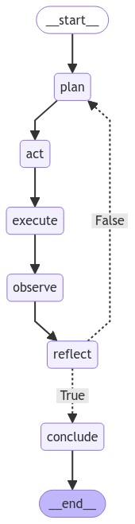

# Repository Overview

## Introduction
This repository contains a Python project focused on multi-agent systems. It utilizes virtual environments and various external libraries to provide a robust framework for developing and managing multi-agent interactions.

## Agent Workflow Diagram

## Directory Structure

### Root Directory
- **.gitignore**: Specifies files and directories that should be ignored by Git, such as `.env` and `/venv`.
- **readme.md**: Provides an overview and documentation for the project.
- **requirements.txt**: Lists the Python dependencies required for the project, which can be installed using `pip`.

### src/ Directory
- **src/multiagent/agent.py**: Contains the implementation of the `Agent` class and related logic for the multi-agent system.

## Example Code Excerpts
- **Agent Class**: Found in `src/multiagent/agent.py`, this class represents an agent in the multi-agent system and includes methods for planning, acting, executing, observing, reflecting, and concluding tasks.

